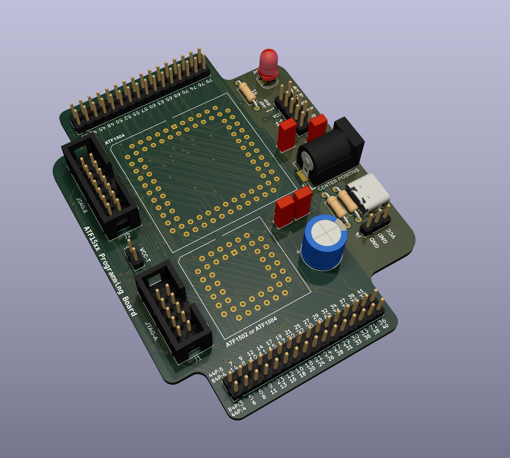

## JTAG Programming & Testing Board for ATF1502 & 1504 CPLDs

### What

This is a small board to support JTAG programming (tested with Microchip ATDH1150USB) 
and general testing of ATF15xx CPLDs.

PLCC44 and PLCC84 variants are directly supported. Power can come from DuPonts, a
5V barrel jack or USB-C.

Board is four layer, and should be easily manufacturable by pretty much any fab you
care to use (I like JLCPCB, YMMV). It's quite small so should be reasonably cheap,
and all components are through-hole so nice and easy to solder.

The are really the last good 5V CPLDs that are in production - make use of them,
encourage Microchip to not discontinue them!

* [ATF1502](https://www.microchip.com/en-us/product/atf1502as)
* [ATF1504](https://www.microchip.com/en-us/product/atf1504as)

### Why?

I needed a board to do some testing with ATF1504 CPLDs for a new 
[rosco_m68k](https://github.com/rosco-m68k/rosco_m68k) thing I was
working on, and thought it might also be useful to others. So here you go.

### Who

Copyright (c)2024 Ross Bamford
Licensed under the Strongly Reciprocal CERN-OHL-S license. 
See LICENSE.md for details

